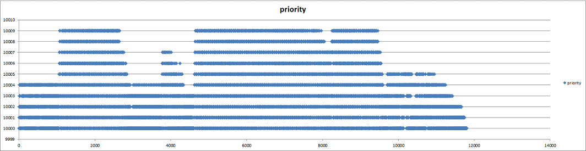
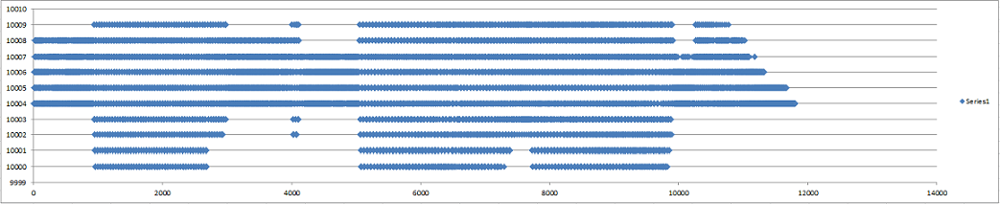
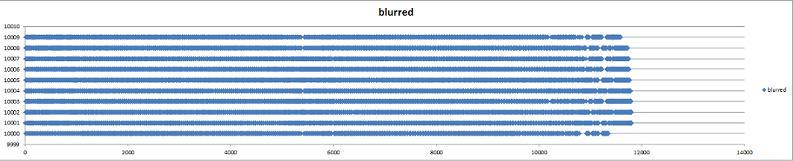

# SGI - Socket Gateway Interface

Application written on Erlang. General design principles is fast, low memory and modularity.

SGI give possibility simple and smart way to connect to any server by [TCP](https://en.wikipedia.org/wiki/Transmission_Control_Protocol)
and have other protocols working under TCP.
It supports the two protocols:
- [FastCGI](https://en.wikipedia.org/wiki/FastCGI). This protocol is common for connect to [PHP (FPM)](http://php.net/manual/en/install.fpm.php).
- [uwsgi](https://uwsgi-docs.readthedocs.io/en/latest/Protocol.html). This protocol is the native protocol used by the [uWSGI](https://uwsgi-docs.readthedocs.io) server.

## Requirements
   
   Erlang 18.1+

## Try Sample
### Sample 1

This sample show you how you can add "Busines Logic" (big or old) to your site using PHP files.

It based on the sample from [n2o](https://github.com/synrc/n2o).

    $ git clone git://github.com/astronin/sgi
    $ cd sgi/samples
    $ ./mad deps compile plan
    $ ./mad repl

Run php as fcgi server

    $ sudo service php5-fpm start

Now you can try it out: http://localhost:8000

### Sample 2

This sample show you how you can run your site(wrote in PHP) with support WebSocket. Forget about Ajax and do your page much faster.

You have follow advantages compared to Ajax even in common web page:
- Fast
- Low overhead, especially over https
- Easy forwarding a file
- Saving CPU resources of both a client and a server

##### Settup:

    $ git clone git://github.com/astronin/sgi
    $ cd sgi/samples
    
Change app in rebar.config:

    $ vim samples/apps/rebar.config
**{sub_dirs, [ "review" ]}**. -> **{sub_dirs, [ "review2" ]}**.

Change app in sys.config:

**{n2o, [{app,review2}]}**

Run FPM:

    $ sudo service php5-fpm start
    
Run Server:

    $ ./mad deps compile plan
    $ ./mad repl

Url:  http://localhost:8000/site.php

### Sample 3

This sample show you how you can run your site (wrote in Python and support **uwsgi** protocol) with support WebSocket.
For this you need use server [uWSGI](https://uwsgi-docs.readthedocs.io/en/latest/).

##### Settup:

    $ git clone git://github.com/astronin/sgi
    $ cd sgi/samples
    
Change app in rebar.config:

    $ vim samples/apps/rebar.config
**{sub_dirs, [ "review" ]}**. -> **{sub_dirs, [ "review3" ]}**.

Change app in sys.config:

```erlang
{n2o, [{app,review3}]},
{sgi, [{servers, [
    [{name, default}, {address, localhost}, {port, 3031}]
]}]}
```

Run uWSGI:

    $ uwsgi --socket 127.0.0.1:3031 --wsgi-file <your path clone>sgi/samples/cgi-scripts/python/myapp.py

Run Server:

    $ ./mad deps compile plan
    $ ./mad repl

Url:  http://localhost:8000/

### Sample 4

This sample show you how you can use TCP Client of this app.
Thanks to the smart balancer Client can connect to any number of servers in different methods: `priority` or `blurred`.

##### Settup:

    $ git clone git://github.com/astronin/sgi
    $ cd sgi/samples
    
Change app in rebar.config:

    $ vim samples/apps/rebar.config
**{sub_dirs, [ "review" ]}**. -> **{sub_dirs, [ "review4" ]}**.

Change app in sys.config:

**{n2o, [{app,review4}]}**

Change following settings in `sys.config`. 
Sample will start 10 servers with 5 processes.
Client will connect with 5 sockets on each server.

```erlang
{servers, [
    [{name, default}, {address, localhost}, {port, 10000}, {timeout, 60000}, {weight, 10}, {start_connections, 4}, {max_connections, 5}, {max_fails, 5}, {failed_timeout, 60}],
    [{name, aaa1},    {address, localhost}, {port, 10001}, {timeout, 60000}, {weight, 9},  {start_connections, 4}, {max_connections, 5}, {max_fails, 5}, {failed_timeout, 60}],
    [{name, aaa2},    {address, localhost}, {port, 10002}, {timeout, 60000}, {weight, 8},  {start_connections, 4}, {max_connections, 5}, {max_fails, 5}, {failed_timeout, 60}],
    [{name, aaa3},    {address, localhost}, {port, 10003}, {timeout, 60000}, {weight, 7},  {start_connections, 4}, {max_connections, 5}, {max_fails, 5}, {failed_timeout, 60}],
    [{name, aaa4},    {address, localhost}, {port, 10004}, {timeout, 60000}, {weight, 6},  {start_connections, 4}, {max_connections, 5}, {max_fails, 5}, {failed_timeout, 60}],
    [{name, aaa5},    {address, localhost}, {port, 10005}, {timeout, 60000}, {weight, 5},  {start_connections, 4}, {max_connections, 5}, {max_fails, 5}, {failed_timeout, 60}],
    [{name, aaa6},    {address, localhost}, {port, 10006}, {timeout, 60000}, {weight, 4},  {start_connections, 4}, {max_connections, 5}, {max_fails, 5}, {failed_timeout, 60}],
    [{name, aaa7},    {address, localhost}, {port, 10007}, {timeout, 60000}, {weight, 3},  {start_connections, 4}, {max_connections, 5}, {max_fails, 5}, {failed_timeout, 60}],
    [{name, aaa8},    {address, localhost}, {port, 10008}, {timeout, 60000}, {weight, 2},  {start_connections, 4}, {max_connections, 5}, {max_fails, 5}, {failed_timeout, 60}],
    [{name, aaa9},    {address, localhost}, {port, 10009}, {timeout, 60000}, {weight, 1},  {start_connections, 4}, {max_connections, 5}, {max_fails, 5}, {failed_timeout, 60}]
]},
{balancing_method, priority}, %blurred or priority
```
    
Run Server:

    $ ./mad deps compile plan
    $ ./mad repl

Change in `sys.config` next `{balancing_method, blurred},`

    $ ./mad repl

Sample will create the two files: `server_distribution(priority).csv` and `server_distribution(blurred).csv`
which show difference between of two methods of connection balancing to a server.
Open files in Excel(or other) and insert `XY(Scater)` graph:


Follow result with next weights: 

Server port | Weight
--- | ---
10000 | 1
10001 | 2
10002 | 3
10003 | 4
10004 | 10
10005 | 9
10006 | 8
10007 | 7
10008 | 6
10009 | 5



## 1. Basic usage

### Use FastCGI protocol with N2O.

#### Configuration

Add follow section to sys.config
```erlang
{sgi, [
    {servers, [
        [{name, default}, {address, localhost}, {port, 9000}, {timeout, 60000}, {weight, 2}, {start_connections, 10}, {max_connections, 1000}, {max_fails, 5}, {failed_timeout, 60}], % failed_timeout in seconds
        [{name, aaa},    {address, localhost}, {port, 9001}, {timeout, 60000}, {weight, 5}, {start_connections, 2}, {max_connections, 4}, {max_fails, 5}, {failed_timeout, 60}]
    ]},
        % max_connections - run N processes with 1 connection on each process. Count cannot be bigger then children of fcgi processes
    {balancing_method, priority}, % priority | blurred, priority is default
    {fcgi_timeout, 600000}, % 10 minutes
    {multiplexed, unknown}, % can be "1" | "0" | unknown
    {vhosts, [
        [
            {server_name, "phphost.com"}, % set your server name(domain), for local tests add line "127.0.0.1 phphost.com" into "/etc/hosts" (in Linux), "C:\Windows\System32\drivers\etc\hosts"(in Windows)
            {aliase, "localhost"},
            {root, "/home/roman/dev/sgi/samples/fcgi-scripts"}, % set you FULL path to your codes
            {index, "index.php"}, % default index file
            {rewrite, [{"*", "index.php"}]}
        ],
        [
            {server_name, "yourhost2.com"}, % set your server name(domain)
            {aliase, "localhost"},
            {root, "/usr/local/www/yourhost2.com"}, % set you full path to your codes
            {index, "index.php"} %% default index file
        ]
    ]}
    ]}
```

- `servers` - Balancing settings
    - `name` - some name of server, can be any string ('default' is default name)
    - `address` - ip, hostname or localhost(default)
    - `port` - the port number (9000 is default port)
    - `timeout` - connection timeout to server (60000 is default number)
    - `weight` - the weight of the server, using for balancing (default - 1)
    - `start_connections` - the number of connections when server start at first time (default - 1)
    - `max_connections` - number of max connections to a server, they will be added if will be necessary, created dynamically (default - 1)
    - `max_fails` - the number of unsuccessful attempts to connect to a server (default - 10)
    - `failed_timeout` - the number in seconds after which a connection will try reuse
- `balancing_method` - set the method for balancing, can be 
    - **priority** (like **Weighted Round Robin**)
    - **blurred**
    
    Method  **priority** based on **weight** of server and send data, firstly, 
    on the connections of this server. The connections of first server 
    in configuration will be in begin of queue, if a weight of servers will equal.
    Unlike the previous method **blurred** distribute the connections 
    alternately, first connection - from first server in configuration.
    Priority method use the connections of one server at first, then it 
    use following servers. Last servers in a queue could be not used with 
    low intensity of requests.
    Blurred method uses all servers but without potential overload one of a server.
- `vhosts` - part of fastcgi

### Steps of request to FCGI

Add deps to rebar.config:
```erlang
{sgi, ".*", {git, "git://github.com/astronin/sgi", {tag, "master"}}}
```
Add initialization of fcgi protocol:
```erlang
sgi_fcgi:init_fcgi()
```
Add new **event** in your file (index.erl):
```erlang
event(#http{url = _Url, method = _Method, body = _Body} = Http)
```
Send data to the FastCGI Server:
```erlang
{Ret, Status, Headers} = sgi_n2o_fcgi_handler:send(Http),
```
Using js code for returning data to the browser:
```erlang
wf:wire("http.back('"++wf:to_list(js_escape(Ret))++"', "++wf:to_list(Status)++", "++wf:to_list(jsone:encode(Headers))++")");
```
Terminate fcgi protocol and clear memory:
```erlang
fcgi_end()
```


## 2. Advanced usage 

Application consists two parts: **Protocol Part** and **Connection Part**.

- Protocol Part - works under TCP connection. For now it included FastCGI implementation.
- Connection Part - is responsible of forwarding a message to a server.

### Protocol Part:

#### FastCGI
The implementation of protocol include two modules: **N2O handler** and **protocol module**.
Other handlers can be written for other frameworks or servers.

##### Using N2O FastCGI Handler

@See **Basic usage...**

##### Using FastCGI Protocol
Module runnable as a process.

Start new fcgi process and start connection with fcgi server
```erlang
{ok, Pid} = sgi_fcgi:start(1,1), % (FCGI_RESPONDER, FCGI_KEEP_CONN)
```
Send message
```erlang
Pid ! {overall, self(), FCGIParams, has_body(Http), Body},
```
Or if you need more flexibility you can use next 3 commands:
Send Params to server, this is pair of `{Key,Value}`
```erlang 
sgi_fcgi:params(Pid, FCGIParams),
```
Send data to a server, using real Pid so without excessive copying
```erlang
Pid ! {5, Body},
```
Send the marker that the request is ended
```erlang
sgi_fcgi:end_req(Pid),
```
Stop fcgi process with the release of resources
```erlang
sgi_fcgi:stop(Pid),
```
Receive message with next tags
```erlang
{sgi_fcgi_return, Out, Err} % common respones
```
```erlang
sgi_fcgi_return_end % end of the requet, we can retun the answer to a browser
```
```erlang
{sgi_fcgi_return_error, Err} % some error
```
```erlang
{sgi_fcgi_timeout, Pid} % self timeout
```

### Connection Part

#### Arbiter
Arbiter decide which stream is free (available), keeps busy socket(process),
and it does not allow the use of extra resources.

#### Multiplexer

Run multiplexer if your application support multiplexing. Even if you don't know,
will be better run multiplexer also, it help your application don't be fail.

```erlang
{ok, _Pid} = sgi_sup:start_child(sgi_multiplexer, {?MODULE, request_pid})
```

You should set callback function where multiplexer will getting your local PID 
from a storage(ETS) by request_id of your request: `{?MODULE, request_pid}`
Set callback after start process `sgi_multiplexer:set_callback({M, F})` or 
set callback to each request `{send, Request, PoolPid, M, F}`.

##### Using

- Search a free stream and hold found

```erlang
{ok, PoolPid} = sgi_arbiter:alloc(),
```
- Send data

```erlang
PoolPid ! {send, Data, self()},
```
*or send data with multiplexer*
```erlang
sgi_multiplexer ! {send, Data, PoolPid},
```
- Receive data from sockets, normal respones

```erlang
handle_info({socket_return, Data}, State)
```
*or was some error with connecting or sending a message*
```erlang
handle_info({socket_error, Data}, State)
```
- To free the held stream

```erlang
sgi_arbiter:free(PoolPid),
```

##### Or easy way if you want Just Send data and just receive message

For example you want send quick(test) message and you do not want write many codes

```erlang
{ok, Bin} = sgi_pool:once_call(Request),
```